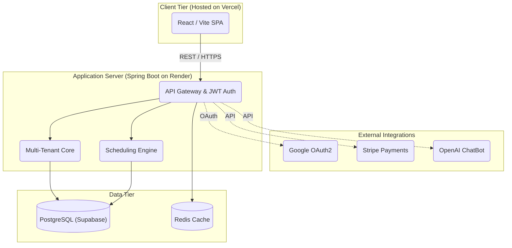

<div align="center">

# 📅 Schedulo — Intelligent Timetable SaaS

**A premium B2B Software-as-a-Service platform that eliminates the complexity of manual scheduling. Schedulo generates conflict-free timetables for educational institutions, businesses, and hospitals using an automated constraint-satisfaction engine.**

[](https://github.com/nims-creation/Scheduleo/actions)
[](https://spring.io/projects/spring-boot)
[](https://reactjs.org/)
[](https://www.postgresql.org/)
[](https://redis.io/)
[](LICENSE)

🌐 **Live Demo:** [scheduleo.vercel.app](https://scheduleo.vercel.app) &nbsp;|&nbsp; 🔧 **API:** [schedulo-api.onrender.com](https://schedulo-api.onrender.com/swagger-ui.html)

</div>

---

## 🚀 Project Overview

Schedulo is a **multi-tenant SaaS platform** that automates the creation of complex timetables. Organisations sign up, configure their resources (rooms, staff, equipment), define constraints, and let the AI-powered engine generate a complete, conflict-free schedule — in milliseconds.

Built with:
- ☕ **Java 21 + Spring Boot 3.3.0** — scalable, production-grade REST API
- ⚛️ **React 18 + Vite** — fast, responsive Single Page Application
- 🐘 **PostgreSQL (Supabase)** — managed relational database
- 🔴 **Redis** — session management and caching
- 🚀 **Deployed on Vercel (Frontend) & Render (Backend)** — fully automated CI/CD

---

## 🏗️ System Architecture

A modern, highly scalable 3-tier architecture designed for enterprise readiness, secure multi-tenancy, and high performance.



### Layer Breakdown

| Layer | Responsibility |
|---|---|
| **React SPA** | Captures constraints, renders interactive calendars, charts, and user management |
| **JWT / Spring Security** | Stateless auth, Google OAuth2 SSO, granular RBAC |
| **Multi-Tenant Core** | Fully isolated organisation workspaces — data never crosses tenant boundaries |
| **Scheduling Engine** | Constraint-satisfaction algorithm for zero-conflict timetable generation |
| **PostgreSQL** | Authoritative relational store: organisations, users, schedules, resources |
| **Redis** | Caching, refresh token store, rate-limit counters |

---

## ✨ Feature Highlights

| Feature | Details |
|---|---|
| 🤖 **AI Timetable Engine** | Auto-generates conflict-free schedules from resource/constraint inputs |
| 🏢 **Multi-Tenant Workspaces** | Isolated organisations — each with their own members, roles, and data |
| 👥 **Team Management** | Invite members, assign roles (Admin / Member), manage departments |
| 📅 **Interactive Calendar** | Month-view calendar with events, public holidays, and schedule overlays |
| 📊 **Reports & Analytics** | Recharts-powered dashboards: utilisation rates, weekly activity, resource usage |
| 🔔 **Real-time Notifications** | In-app notification centre with mark-as-read and polling |
| 💳 **Billing & Subscriptions** | Free / Pro / Enterprise tiers with multi-currency support (INR, USD, EUR, GBP, JPY) |
| 🔐 **Google OAuth2 SSO** | One-click sign-in via Google alongside email/password auth |
| 🤖 **AI Chatbot** | Floating assistant powered by OpenAI for scheduling guidance |
| 📋 **Activity Log** | Full audit trail of every action taken across the organisation |
| 📦 **Resource Management** | Rooms, labs, equipment, vehicles — with availability toggles |

---

## 💻 Technology Stack

| Domain | Technologies |
|---|---|
| **Frontend** | React 18, Vite, Context API, React Router v6, Axios, Recharts, Lucide Icons, Vanilla CSS |
| **Backend** | Java 21, Spring Boot 3.3.0, Spring Security, Spring Data JPA, Hibernate ORM |
| **Database** | PostgreSQL 16 (Supabase managed), Redis 7 |
| **Auth** | JWT (RS256), Google OAuth2, BCrypt |
| **Payments** | Stripe Payment Gateway (simulated), multi-currency support |
| **Notifications** | Resend (email), ClickSend (SMS), Twilio (WhatsApp) |
| **AI** | OpenAI API (chatbot assistant) |
| **Storage** | Supabase Storage |
| **DevOps** | Vercel (Frontend), Render (PaaS Backend), Docker Compose, GitHub Actions |
| **Docs** | Swagger / OpenAPI 3 |
| **Tooling** | Maven, NPM, ESLint, Git |

---

## 📁 Project Structure

```
Schedulo/
├── Schedulo/               # Spring Boot backend
│   ├── src/main/java/
│   │   └── com/saas/Schedulo/
│   │       ├── config/         # Security, CORS, Redis, Swagger
│   │       ├── controller/     # REST API endpoints
│   │       ├── dto/            # Request / response DTOs
│   │       ├── entity/         # JPA entities
│   │       ├── repository/     # Spring Data repositories
│   │       ├── security/       # JWT filters, OAuth2 handlers
│   │       └── service/        # Business logic & scheduling engine
│   ├── src/main/resources/
│   │   └── application.yml     # Profiles: dev / prod
│   └── .env.example            # Required environment variables
│
├── frontend/               # React + Vite SPA
│   ├── src/
│   │   ├── components/     # ChatBot, shared UI
│   │   ├── context/        # AuthContext (JWT state)
│   │   ├── pages/          # Login, Signup, Dashboard, sub-pages
│   │   └── services/       # Axios API client
│   └── vite.config.js
│
├── .github/workflows/      # GitHub Actions CI/CD
├── docker-compose.yml      # Local dev stack (Postgres + Redis)
└── README.md
```

---

## 🛠️ Getting Started (Local)

### Prerequisites

- **Java 21+**
- **Node.js 18+** and npm
- **PostgreSQL 16** on port 5432
- **Redis 7** (local or cloud)

### 1. Clone the repository

```bash
git clone https://github.com/nims-creation/Scheduleo.git
cd Scheduleo
```

### 2. Configure environment variables

```bash
cp Schedulo/.env.example Schedulo/.env
# Edit .env with your local values
```

Key variables to set:

```env
POSTGRES_HOST=localhost
POSTGRES_DB=schedulo
JWT_SECRET=<base64-encoded 256-bit secret>
GOOGLE_CLIENT_ID=<your-google-client-id>
GOOGLE_CLIENT_SECRET=<your-google-client-secret>
FRONTEND_URL=http://localhost:5173
```

### 3. Start the database stack (optional via Docker)

```bash
docker-compose up -d
```

### 4. Run the backend

```bash
cd Schedulo
./mvnw spring-boot:run
# API available at http://localhost:8080
# Swagger UI at http://localhost:8080/swagger-ui.html
```

### 5. Run the frontend

```bash
cd frontend
npm install
npm run dev
# App available at http://localhost:5173
```

---

## 🌐 Production Deployment (Render)

The frontend is deployed as a static site on **Vercel**, and the backend is deployed as a Web Service on **Render**.

| Service | URL | Platform |
|---|---|---|
| **Frontend** | https://scheduleo.vercel.app | Vercel |
| **Backend API** | https://schedulo-api.onrender.com | Render |
| **Swagger UI** | https://schedulo-api.onrender.com/swagger-ui.html | Render |
| **Database** | Supabase (PostgreSQL — transaction pooler) | Supabase |

The pipeline runs on every push to `main`:
1. **Lint** — ESLint checks the entire frontend codebase
2. **Build** — Maven builds the Spring Boot JAR; Vite builds the SPA
3. **Deploy** — Render auto-deploys on successful builds

---

## 📄 API Documentation

The full OpenAPI 3.0 specification is committed to the repo for offline browsing and Postman import.

| Resource | Link |
|---|---|
| **Swagger UI (live)** | https://schedulo-api.onrender.com/swagger-ui.html |
| **OpenAPI JSON (static)** | [docs/openapi.json](./docs/openapi.json) |

**Import into Postman:**
1. Open Postman → Import → Link
2. Paste: `https://schedulo-api.onrender.com/v3/api-docs`
   — OR —
   File → Import → select `docs/openapi.json` for offline use

---

## 🔐 Security Design

- **Stateless JWT** — access tokens (15 min) + refresh tokens (7 days) stored in `localStorage`
- **Google OAuth2** — server-side redirect flow; tokens resolved by Spring Security
- **RBAC** — `ROLE_ADMIN` / `ROLE_MEMBER` enforced at method and endpoint level
- **CORS** — strictly scoped to the frontend origin
- **Account Lockout** — Automatic account lock after 5 failed login attempts (30-minute cooldown)
- **Rate Limiting** — Bucket4j token-bucket: 5 login / 3 signup requests per IP per 15–60 min window
- **BCrypt** — passwords hashed with strength factor 12

---

## 🤝 Contributing & Showcase

This platform was engineered to demonstrate deep full-stack competency — from constraint-solving algorithms and multi-tenant architecture to polished UI/UX and production deployment.

For **recruiters or technical reviewers**, the highest-value areas to explore are:

- `Schedulo/src/.../service/impl/timetable/` — the core scheduling engine
- `Schedulo/src/.../security/` — JWT + OAuth2 security pipeline
- `frontend/src/pages/dashboard/` — rich dashboard pages (Calendar, Reports, Billing)
- `.github/workflows/` — automated CI/CD pipeline

---

<div align="center">
<i>Architected & built to handle complex scheduling at scale — elegantly.</i>
</div>
